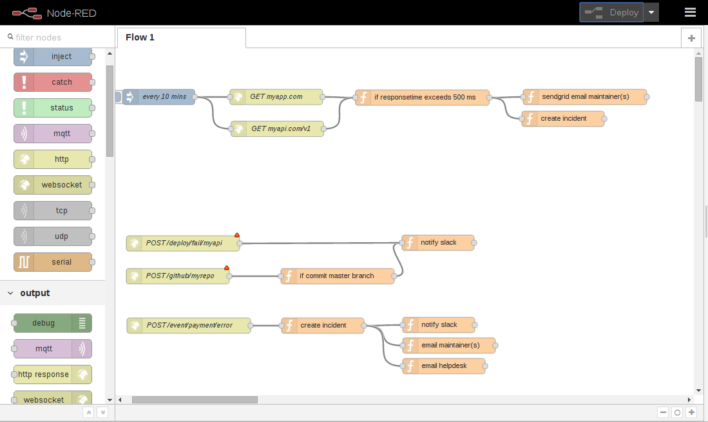
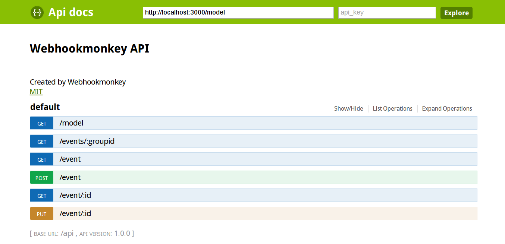
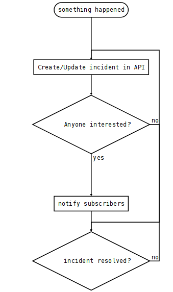

Prevent webhook-spaghetti: webhook patching and monitoring (using google analytics events).
Comes with api and editor to easily broke, aggregate and route webhooks.

> "We've managed to automate everything using webhooks..I think"

\

    +------------------+        +---------------------------+
    | storage api      |<------>| modular webhook platform  |------> IFTTT/Zapier/servers/Ganalytics/etc
    +------------------+        +---------------------------+
            ^                                ^
            |                                |
            |                                |
      manage history                      webhooks
                                      github/bb/apps/servers/SaaS

## Usage

    $ PORT_WEBHOOKS=3001 PORT_API=3000 API_URL="http://localhost:3000" node app.js

## Features

Incidental is focusing on webhook monitoring & webhook patching. 
For __microservice__ monitoring check [TRACE](https://trace.risingstack.com/)

* visually glue microservices together
* visually aggregate & organize webhooks
* store incidents,metrics in storage api using REST
* REST api perfect to integrate in backends

## The api & editor

* The api documentation is generated at `http://localhost:3000/doc`, and a swagger url at `http://localhost:3000/model`
* The [webhook editor](https://npmjs.org/package/node-red) can be visited at `http://localhost:3001`

By default, the api is just an simple example of incident & history storage, which the webhook 
editor can extend on.
Right now it demonstrates this incident & history cycle:

## Doing api requests

* use [swagger-client](https://npmjs.org/package/swagger-client) to easily call the api (using the swagger url, see `lib/index.js`)
* create `http` nodes in the editor to setup custom points 
* use `context.global.lib.api` in a script-node inside the editor to do internal api-calls

## Extending 

* For hardcoded (testable) logic use lib/index.js as entrypoint.
* For simple wiring/glue code just use script-nodes in the editor.

> lib/index.js is exposed as `context.global.lib` inside a script-node (in the editor)

## Storage

You can easily swap storage (SQL/Mongodb/Redis/etc), see [flowee docs](http://flowee.isvery.ninja)

## Notes 

* you need to enable security in `config/webhook.js` (see [node-red](https://npmjs.org/package/node-red) for more info )
