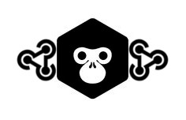
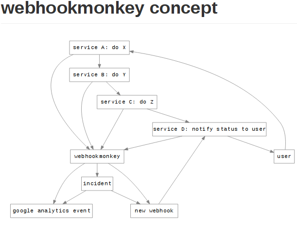

 

> "We've managed to automate everything using webhooks..at least I think"

Prevent webhook-spaghetti: webhook monkeypatching and monitoring (using google analytics events).
Comes with api and editor to easily broke, aggregate and route webhooks.

\

                webhookmonkey
       +---------------------------+
       |   api  +    flow editor   |------> IFTTT
       +---------------------------+        Zapier
                    ^                       server A/B/C
                    |                       Ganalytics
                    |                       Bitbucket/github 
                    |                       etc
                 webhooks <------------------

## Usage

    $ PORT_WEBHOOKS=3001 PORT_API=3000 GANALYTICS_TOKEN=X-XXXXXXX API_URL="http://localhost:3000/model" node app.js

## Features

Webhookmonkey is focusing on webhook monitoring & webhook monkeypatching. 
For __microservice__ monitoring check [TRACE](https://trace.risingstack.com/)

* visually setup and glue webhooks together
* monitor webhook transactions
* save webhook history to DB (REST API)
* integrate with backoffice thru REST 

Webhookmonkey does not force you to centralize your infrastructure, it just sits in the sweet spot:

## The api & editor

* The api documentation is generated at `http://localhost:3000/doc`, and a swagger url at `http://localhost:3000/model`
* The [webhook editor](https://npmjs.org/package/node-red) can be visited at `http://localhost:3001`

By default, the api is just simple storage of webhook-history.
The webhook editor applies some example logic to the api.
However, this editor allows you to extend it with any (js) logic.

API request example:

    curl -X POST "http://localhost:3000/event" -H 'Content-Type: application/vnd.api+json' --data '{"data":{"type":"event","attributes":{"category":"foo","groupid":"mygroupid","service":"myservice","label":"mylabel","value":5,"data":{}}}}'

## Doing api requests

* use [swagger-client](https://npmjs.org/package/swagger-client) to easily call the api (using the swagger url, see `lib/index.js`)
* create `http` nodes in the editor to setup custom points 
* use `context.global.lib.api` in a script-node inside the editor to do internal api-calls

## Extending 

* For hardcoded (testable) logic use lib/index.js as entrypoint.
* For simple wiring/glue code just use script-nodes in the editor.

> lib/index.js is exposed as `context.global.lib` inside a script-node (in the editor)

## Storage

You can easily swap storage (SQL/Mongodb/Redis/etc), see [flowee docs](http://flowee.isvery.ninja)

## Notes 

* you need to enable security in `config/webhook.js` (see [node-red](https://npmjs.org/package/node-red) for more info )
